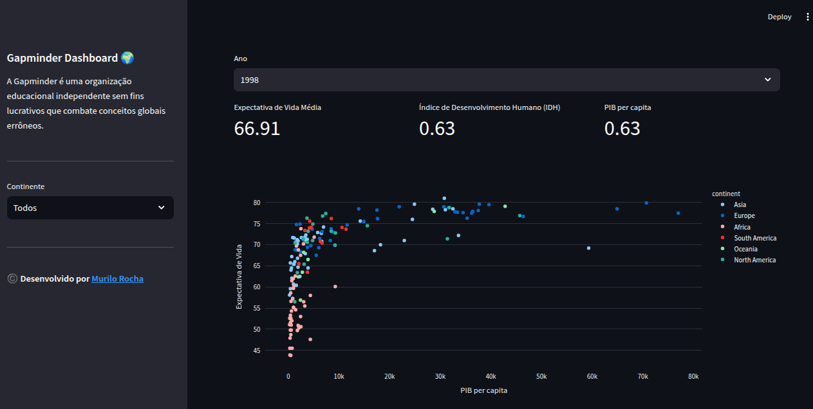

# Gapminder Dashboard 🌍

O **Gapminder Dashboard** é uma visualização interativa que utiliza dados globais sobre o PIB per capita, expectativa de vida, Índice de Desenvolvimento Humano (IDH) e outros indicadores para explorar as disparidades e tendências globais ao longo do tempo. Este painel foi desenvolvido utilizando **Streamlit** e **Plotly Express**, proporcionando uma forma intuitiva e dinâmica de visualizar e entender os dados.

## Funcionalidades

- **Seleção de Ano**: Permite filtrar os dados por ano específico.
- **Filtragem por Continente**: Selecione o continente desejado ou visualize dados globais.
- **Indicadores Globais**: Exibe métricas como Expectativa de Vida, IDH e PIB per capita para o ano selecionado.
- **Gráfico Interativo**: Exibe um gráfico de dispersão mostrando a relação entre PIB per capita e Expectativa de Vida, com a opção de colorir por continente.

    
## Tecnologias Utilizadas

- **Streamlit**: Framework para criação do painel interativo.
- **Plotly Express**: Biblioteca para criação de gráficos interativos.
- **Pandas**: Biblioteca para manipulação e filtragem dos dados.
  
## Sobre o Projeto

Este projeto foi desenvolvido para proporcionar uma análise visual das disparidades globais, focando em indicadores econômicos e sociais. Ele usa dados do **Gapminder**, uma organização que oferece dados sobre desenvolvimento global de maneira acessível e fácil de entender.

## Licença

Distribuído sob a licença MIT. Veja o arquivo [LICENSE](LICENSE) para mais detalhes.

## Contato

Desenvolvido por [Murilo Rocha](https://www.linkedin.com/in/murilo-silva-ia/).

## Imagem de Exemplo

